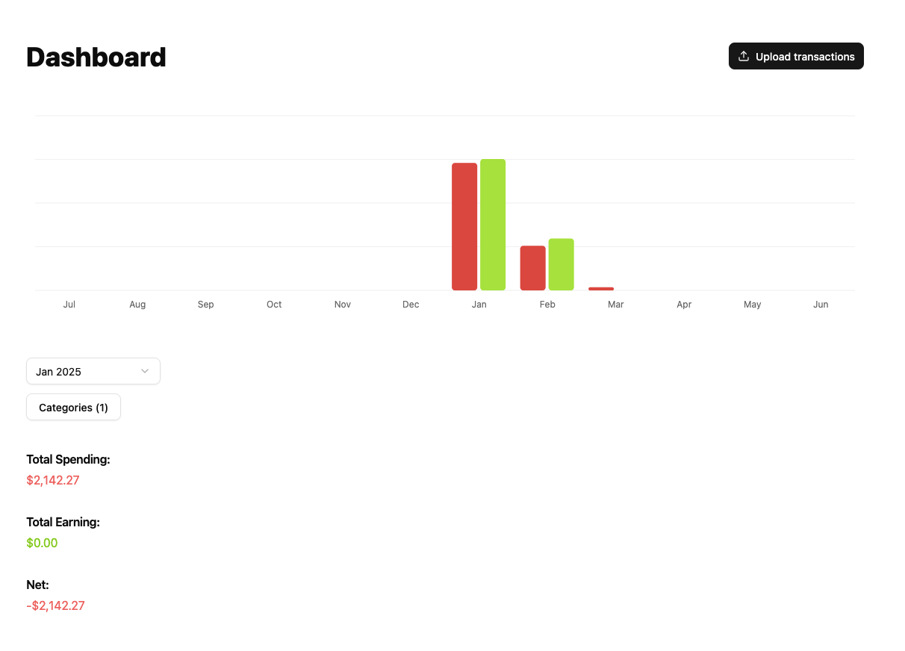

# Personal Transaction Manager

A simple personal transaction manager to keep track of my expenses and income.




## Generating contracts

Contracts (api DTOs) between the front and backend are generating using [between]("https://github.com/brahms116/between")

Run the following commands after making appropiate changes to `contracts.bt`

```bash
bt --input ./contracts.bt --output ./fe/src/contracts.ts && prettier -w ./fe/src/contracts.ts
bt --input ./contracts.bt --output ./pkg/contracts/contracts.go && gofmt -w ./pkg/contracts/contracts.go
```
